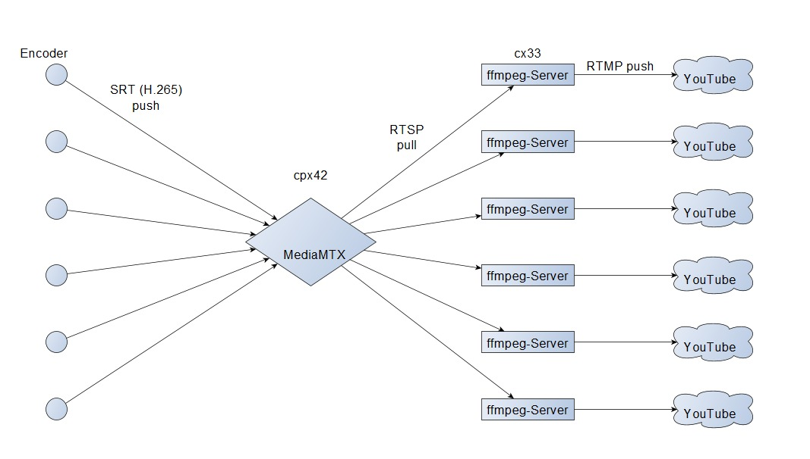

# showdownBSCPraha2026

# showdownBSCPraha2026

## Ziel des Repos

Dieses Repository dokumentiert das technische Setup für das Showdown-Event **BSC Praha 2026**.

Im Kern geht es um eine einfache, robuste Produktionskette für mehrere parallele Tisch-Streams:

- RTSP-Ingest pro Tisch
- FFmpeg-basierte Weiterverarbeitung
- zeitgesteuertes Text-Overlay aus externen Dateien
- H.264-Encoding für YouTube
- systemd-basierter Dauerbetrieb auf Linux

Das Repo ist bewusst praxisnah gehalten. Es ist keine generische Streaming-Plattform, sondern eine konkrete, im Eventbetrieb eingesetzte Lösung.

---

## Grundidee

Für jeden Tisch läuft ein eigener FFmpeg-Prozess.  
Dieser Prozess:

1. liest den jeweiligen RTSP-Stream,
2. blendet eine Textdatei als Overlay ein,
3. encodiert das Video nach H.264,
4. übernimmt das Audio unverändert,
5. sendet den Stream an YouTube.

Die Overlay-Texte werden nicht direkt in FFmpeg erzeugt, sondern durch ein separates Python-Skript vorbereitet.  
Dieses Skript liest den Spielplan aus einer JSON-Datei und schreibt pro Tisch eine kleine Textdatei, die FFmpeg live einblendet.

Dadurch bleiben **Streaming-Logik** und **Match-/Overlay-Logik** sauber getrennt.

---

## Repository-Struktur

### `ffmpeg-table/`

Enthält die Streaming-Seite pro Tisch:

- `run-ffmpeg-table.sh`  
  Startet FFmpeg für einen Tisch-Stream mit Overlay und YouTube-Output.

- `ffmpeg-table.env`  
  Enthält die variablen Umgebungswerte wie Host, Port, Tischnummer und Stream-Key.

- `ffmpeg-table.service`  
  systemd-Service zum stabilen Dauerbetrieb.

### `overlay/`

Enthält die Overlay-Logik:

- `overlay_writer.py`  
  Liest den Spielplan und erzeugt pro Tisch eine Textdatei für FFmpeg.

- `schedule.json`  
  Spielplan als Datenquelle für das Overlay.

- `overlay-writer.service`  
  systemd-Service für den Overlay-Writer.

---

## Overlay-Logik

Der Overlay-Writer erzeugt pro Tisch eine Datei wie:

- `/var/overlays/table1.txt`
- `/var/overlays/table2.txt`
- ...

FFmpeg liest diese Dateien mit `drawtext=textfile=...:reload=1` regelmäßig neu ein.

Die Anzeige folgt einer einfachen Zeitlogik:

- **vor dem ersten Match:**  
  `TABLE X / First match at HH:MM`

- **während eines Match-Slots:**  
  aktuelles Match mit Spielern, Nationen und ggf. Referee

- **kurz vor dem nächsten Match:**  
  `NEXT TABLE X HH:MM ...`

- **sonst:**  
  leere Datei bzw. kein Text

Wichtig:  
Die Logik ist **zeitbasiert**, nicht signalbasiert.  
Das Skript weiß also nicht, ob auf dem Tisch wirklich schon gespielt wird, sondern orientiert sich ausschließlich am Spielplan.

---

## AV-Synchronität

In der FFmpeg-Kette gibt es eine optionale zusätzliche `VIDEO_DELAY`-Korrektur über `setpts=PTS+X/TB`.

Das ist **keine generelle Latenzsteuerung**, sondern eine pragmatische Nachkorrektur für Fälle, in denen Ton und Bild in der Verarbeitungskette sichtbar auseinanderlaufen.

Wichtig:

- In diesem Setup kann **nur das Video verzögert** werden.
- Das Audio wird mit `-c:a copy` unverändert übernommen.
- Eine Audio-Verzögerung ist in dieser Version **nicht** vorgesehen.

---

## Warum das Overlay aus Textdateien kommt

Die Trennung über Textdateien hat im Eventbetrieb mehrere Vorteile:

- FFmpeg bleibt einfach und stabil
- Matchlogik kann unabhängig in Python angepasst werden
- Änderungen im Overlay erscheinen ohne FFmpeg-Neustart
- jede Tischinstanz bleibt gleich aufgebaut
- Fehler sind leichter einzugrenzen

---

## Betriebsmodell

Das Setup ist für Linux-Server mit `systemd` gedacht.

Typischer Ablauf:

1. Spielplan als `schedule.json` bereitstellen
2. Overlay-Writer starten
3. FFmpeg-Service pro Tisch starten
4. Streams und Overlays im laufenden Betrieb überwachen

Die Services sind bewusst klein und direkt gehalten, damit sie vor Ort und unter Eventdruck schnell verstanden und angepasst werden können.

---

## Bekannte Vereinfachungen / Grenzen

- Match-Erkennung erfolgt rein über Uhrzeit, nicht über echte Tabellen- oder Turniersignale
- Änderungen an `schedule.json` werden aktuell erst nach Neustart des Overlay-Writers übernommen
- AV-Korrektur ist nur auf der Videoseite vorgesehen
- Das Setup ist auf den konkreten Showdown-Anwendungsfall zugeschnitten und nicht als universelles Broadcast-Framework gedacht

---

## Einsatzkontext

Diese Lösung wurde für ein mehrtägiges Showdown-Event mit mehreren parallelen Tischen entworfen, bei dem:

- mehrere gleichartige Tisch-Streams parallel laufen,
- pro Tisch ein eigener YouTube-Stream ausgegeben wird,
- einfache, gut lesbare Match-Overlays benötigt werden,
- robuste und leicht verständliche Linux-Services wichtiger sind als maximale Abstraktion.

---

## Mögliche spätere Erweiterungen

- Live-Reload von `schedule.json` ohne Service-Neustart
- flexiblere Formatierung des Overlays
- Unterstützung weiterer Turnierdatenfelder
- Multi-Event-/Multi-Day-Handling mit Konfiguration statt Hardcoding
- sauberer Installer für neue Hosts

---

## Status

Praxisnahes Event-Repository mit Fokus auf:

- Verständlichkeit
- schneller Anpassbarkeit
- robuster Betrieb unter realen Bedingungen
